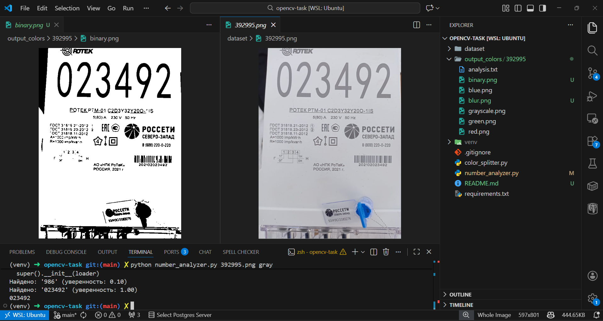

# Установка зависимостей
```bash
  python -m venv venv
  source /venv/bin/activate
  pip install -r requirements.txt
```
# Запуск
1. Разложение изображения по цветам, создание отчета:
```bash
  python color_splitter.py 392995.png #название изображения в директории /dataset
```
Результаты будут лежать в директории output_colors/название_изображения.

2. Распознавание номера счетчика на изображении:
```bash
  python number_analyzer.py 392995.png gray #название цветового канала изображения
```
Результат будет выведен в консоль. blur и binary будут находиться в output_colors/название_изображения.
# Пример работы

# Структура 
```
opencv-task/
├── dataset/                    # исходные изображения
├── output_colors/              # результаты обработки (+Пример для 392995.png)
├── screenshots/                 # скриншоты для README
├── color_splitter.py
├── number_analyzer.py
├── .gitignore
├── requirements.txt
└── README.md
```